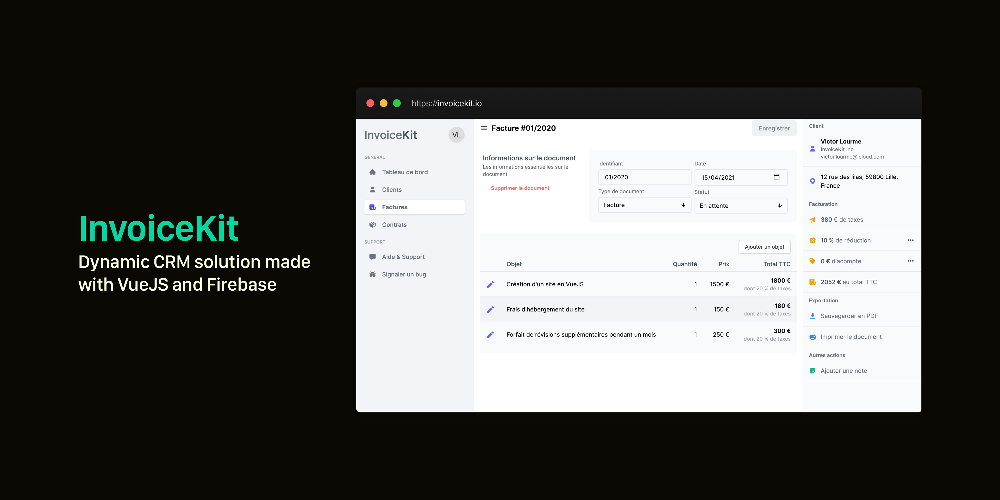

# InvoiceKit

InvoiceKit is a static website using Nuxt and Firebase to manage customers, invoices, contracts and more, it's a kind of CRM that aims to be easy to use and modulable with dynamic fields, team support, etc...

A more documented README will be redacted soon, you can still contribute!

**This project is a work-in-progress. This is actually not usable.**

## Contribute

### Project Structure

```sh
.
├── assets # Every uncompiled assets (CSS, JS).
├── components # Components that aims to be re-used (navbar, forms, etc.)
├── layouts
│   ├── auth.vue # Authentication Layout
│   ├── dashboard.vue # Dashboard and more, accessible to authenticated users
│   └── default.vue # Default layout, will be used for landing page
├── middleware
│   ├── auth.ts # Prevent user accessing dashboard without being logged
│   └── preventAuth.ts # Prevent logged user doing a new registration or login
├── pages # Every pages
├── static # Static files (images, favicon, etc.)
├── store # Vuex Store (contains User and Authentication related code)
├── implementations # Class implemeting TS Types
└── types # TypeScript types
```

### Build Setup

```bash
# Clone project
$ git clone https://github.com/vlourme/invoicekit

# install dependencies
$ npm install

# serve with hot reload at localhost:3000
$ npm run dev

# build for production and launch server
$ npm run build
$ npm run start

# generate static project
$ npm run generate
```

**Important!** You'll need to setup Firebase. Create a project on [Firebase dashboard](https://console.firebase.google.com/), then copy your configuration in `nuxt.config.ts` at `modules -> '@nuxt/firebase' -> config`.

Then, while using the app, Firebase library creates collections automatically. There is nothing more to do (no indexes, etc.).

### Documentations

This project is based on these dependencies:

- [NuxtJS](https://nuxtjs.org) for the structure.
- [VueJS](https://vuejs.org) as framework (along with Nuxt).
- [Firebase](https://firebase.google.com/docs) for storing data.
- [@nuxt/firebase](https://firebase.nuxtjs.org/) module to improve firebase usage.
- [Vuex](https://vuex.vuejs.org/) to manage state.
- [@nuxt/typescript](https://typescript.nuxtjs.org/) to support TypeScript with Vue.
- [Vuetify](https://vuetifyjs.com/) to build UI.

### Contributions rules

While working on this project, please keep in mind a few things:

- Keep it simple, try to simplify the maximum you can the code.
- Avoid using work-around. Use work-around only if there is no other ways.
- Use TypeScript. Actually, we're using [Options API](https://typescript.nuxtjs.org/cookbook/components) but as soon as [Vuetify](https://vuetifyjs.com/) gets updated to support Vue 3.0, we'll switch to [Composition API](https://v3.vuejs.org/guide/composition-api-introduction.html). We'll not use Class API for the moment.
- Commonize code when it's possible. If you're developing something that can be reusable, then make it reusable component.
